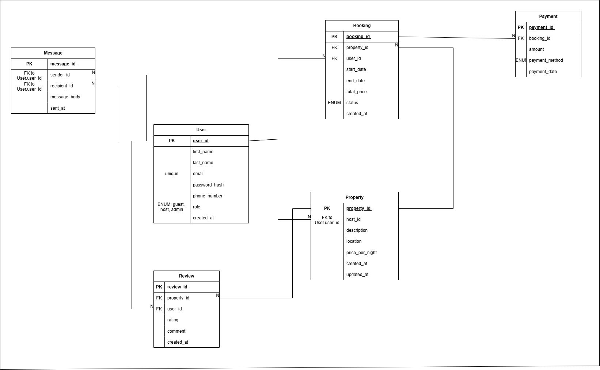

# Entity-Relationship Diagram (ERD) for Airbnb Database

## Overview

This document outlines the Entity-Relationship Diagram for an Airbnb-like database system. It visualizes all core entities, their attributes, and relationships, helping ensure a robust and normalized design.

---

## Entities and Attributes

### 🧑‍💼 User
- `user_id`: UUID, Primary Key
- `first_name`: VARCHAR, NOT NULL
- `last_name`: VARCHAR, NOT NULL
- `email`: VARCHAR, UNIQUE, NOT NULL
- `password_hash`: VARCHAR, NOT NULL
- `phone_number`: VARCHAR, NULL
- `role`: ENUM('guest', 'host', 'admin'), NOT NULL
- `created_at`: TIMESTAMP, DEFAULT CURRENT_TIMESTAMP

### 🏡 Property
- `property_id`: UUID, Primary Key
- `host_id`: Foreign Key → User(user_id)
- `name`: VARCHAR, NOT NULL
- `description`: TEXT, NOT NULL
- `location`: VARCHAR, NOT NULL
- `pricepernight`: DECIMAL, NOT NULL
- `created_at`: TIMESTAMP, DEFAULT CURRENT_TIMESTAMP
- `updated_at`: TIMESTAMP, ON UPDATE CURRENT_TIMESTAMP

### 📅 Booking
- `booking_id`: UUID, Primary Key
- `property_id`: Foreign Key → Property(property_id)
- `user_id`: Foreign Key → User(user_id)
- `start_date`: DATE, NOT NULL
- `end_date`: DATE, NOT NULL
- `total_price`: DECIMAL, NOT NULL
- `status`: ENUM('pending', 'confirmed', 'canceled'), NOT NULL
- `created_at`: TIMESTAMP, DEFAULT CURRENT_TIMESTAMP

### 💳 Payment
- `payment_id`: UUID, Primary Key
- `booking_id`: Foreign Key → Booking(booking_id)
- `amount`: DECIMAL, NOT NULL
- `payment_date`: TIMESTAMP, DEFAULT CURRENT_TIMESTAMP
- `payment_method`: ENUM('credit_card', 'paypal', 'stripe'), NOT NULL

### ⭐ Review
- `review_id`: UUID, Primary Key
- `property_id`: Foreign Key → Property(property_id)
- `user_id`: Foreign Key → User(user_id)
- `rating`: INTEGER (1 to 5), NOT NULL
- `comment`: TEXT, NOT NULL
- `created_at`: TIMESTAMP, DEFAULT CURRENT_TIMESTAMP

### ✉️ Message
- `message_id`: UUID, Primary Key
- `sender_id`: Foreign Key → User(user_id)
- `recipient_id`: Foreign Key → User(user_id)
- `message_body`: TEXT, NOT NULL
- `sent_at`: TIMESTAMP, DEFAULT CURRENT_TIMESTAMP

---

## Relationships

- A **User** can be a **Guest**, **Host**, or **Admin**
- A **Host (User)** can have multiple **Properties**
- A **Guest (User)** can book multiple **Properties**
- A **Property** can have many **Bookings**
- A **Booking** can have one **Payment**
- A **Guest** can leave a **Review** on a **Property**
- Users can send **Messages** to each other

---

## ERD Diagram

> 📌 *Note: The diagram above was created using Draw.io and exported as `erd.png`. Ensure this file is inside the `ERD/` folder in your GitHub repository.*

---

## Tools Used

- **Diagram Tool**: [Draw.io](https://draw.io)
- **Database Design Reference**: Airbnb simplified model

